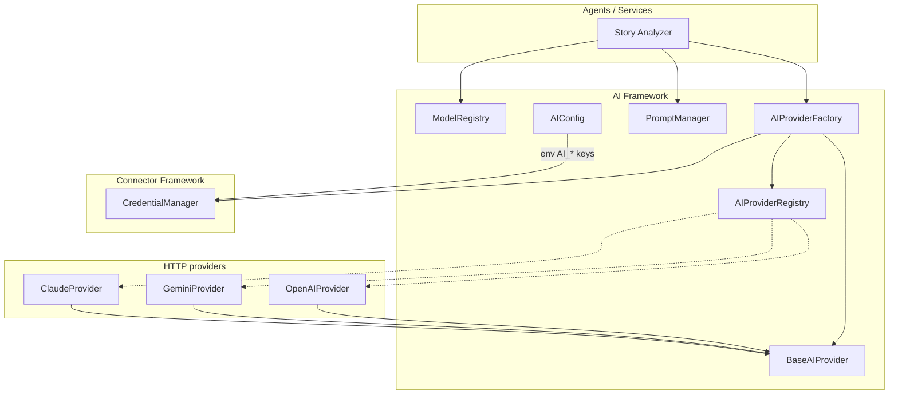

# AI Framework

## Document Information

| Field | Value |
|-------|-------|
| Milestone | AI Framework (provider abstraction) |
| Status | **Complete** — Story Analyzer consumes this framework |
| Last Updated | 2026-07-16 |
| Package | `backend/app/ai/` |

---

## 1. Purpose

Reusable, provider-agnostic LLM layer for the AI QA Platform. Application code (agents, services) never calls OpenAI / Gemini / Claude SDKs directly — only `BaseAIProvider` via the factory and logical models via `ModelRegistry`.

Story Analyzer business logic lives in [`docs/StoryAnalyzer.md`](./StoryAnalyzer.md).
---

## 2. Package Layout

```
backend/app/ai/
├── base/              # BaseAIProvider + shared types
├── providers/         # openai, gemini, claude (httpx HTTP clients)
├── registry/          # Dynamic provider registration
├── factory/           # Instantiation + credential injection
├── models/            # Logical model → provider+model mapping
├── prompts/           # PromptManager + text templates
│   └── templates/
├── config/            # AISettings / AIConfig helpers
├── exceptions/        # Framework errors
└── runtime.py         # Process-wide singletons + register_builtin_ai_providers()
```

---

## 3. Architecture



**Rules**

1. Callers use logical model names (`default`, `fast`, …) or provider keys (`openai`).
2. Secrets come from `AI_*_API_KEY` env vars (seeded into Credential Manager at startup) or explicit `api_key=` / stored credentials.
3. Missing API keys raise `AICredentialError` with a clear message — no silent empty calls.

---

## 4. Provider contract

```python
class BaseAIProvider(ABC):
    async def generate(self, request: GenerateRequest) -> GenerateResponse: ...
    async def health_check(self) -> AIHealth: ...
    def metadata(self) -> AIProviderMetadata: ...
```

| Provider | Endpoint style |
|----------|----------------|
| OpenAI | `POST /v1/chat/completions` |
| Gemini | `POST /v1beta/models/{model}:generateContent` |
| Claude | `POST /v1/messages` |
| Bedrock | `POST /model/{modelId}/converse` (Bearer API key) |

All use **httpx** (async). No official SDKs required.

Amazon Bedrock keys (often prefixed `AQ.`) go in `AI_BEDROCK_API_KEY`. Set `AI_DEFAULT_PROVIDER=bedrock` to power Analyze / Generate / Failure Analysis.

---

## 5. Configuration (`AI_*` env vars)

| Variable | Default | Purpose |
|----------|---------|---------|
| `AI_DEFAULT_PROVIDER` | `openai` | Default provider key |
| `AI_DEFAULT_MODEL` | `gpt-4o-mini` | Default logical/default model id |
| `AI_REQUEST_TIMEOUT_SECONDS` | `60` | HTTP timeout |
| `AI_OPENAI_API_KEY` | — | OpenAI secret |
| `AI_OPENAI_BASE_URL` | `https://api.openai.com/v1` | OpenAI base URL |
| `AI_OPENAI_DEFAULT_MODEL` | `gpt-4o-mini` | OpenAI default model |
| `AI_GEMINI_API_KEY` | — | Gemini secret |
| `AI_GEMINI_BASE_URL` | `https://generativelanguage.googleapis.com/v1beta` | Gemini base URL |
| `AI_GEMINI_DEFAULT_MODEL` | `gemini-flash-latest` | Gemini default model (works with new `AQ.` AI Studio keys) |
| `AI_CLAUDE_API_KEY` | — | Anthropic secret |
| `AI_CLAUDE_BASE_URL` | `https://api.anthropic.com/v1` | Claude base URL |
| `AI_CLAUDE_DEFAULT_MODEL` | `claude-sonnet-4-20250514` | Claude default model |
| `AI_CLAUDE_API_VERSION` | `2023-06-01` | Anthropic API version header |
| `AI_BEDROCK_API_KEY` | — | Amazon Bedrock API key (bearer) |
| `AI_BEDROCK_REGION` | `us-east-1` | Bedrock Runtime region |
| `AI_BEDROCK_BASE_URL` | derived from region | Override runtime base URL |
| `AI_BEDROCK_DEFAULT_MODEL` | `amazon.nova-lite-v1:0` | Default Bedrock model id |

Defined on `app.core.config.Settings` and mirrored by `app.ai.config.AISettings`.

---

## 6. Runtime wiring

`register_builtin_ai_providers()` runs in app lifespan (`factory.py`) after connector registration:

1. Registers OpenAI / Gemini / Claude classes
2. Seeds Credential Manager from env keys when present
3. Registers logical model aliases (`default`, `fast`, `balanced`, `gemini-flash`)

Usage sketch (Story Analyzer):

```python
from app.ai.runtime import ai_factory, model_registry, prompt_manager
from app.ai import ChatMessage, GenerateRequest, MessageRole

binding = model_registry.resolve("fast")
provider = ai_factory.create(binding.provider)
prompt = prompt_manager.render("story_analyze", {"title": "...", ...})
response = await provider.generate(
    GenerateRequest(
        model=binding.model,
        messages=[ChatMessage(role=MessageRole.USER, content=prompt)],
    )
)
```

Prefer `StoryAnalyzerService` for production paths — it handles prompt variables, JSON parsing, and persistence.

---

## 7. Prompts

`PromptManager` loads `*.txt` / `*.md` from `backend/app/ai/prompts/` (and `templates/`). Variables use `string.Template` syntax: `$name` or `${name}`.

Shipped samples: `echo`, `health_check`, **`story_analyze`**.

---

## 8. Tests

```bash
cd backend
source venv/bin/activate
pytest tests/test_ai_framework.py -v
```

All provider HTTP traffic is mocked; no live API keys are required.
