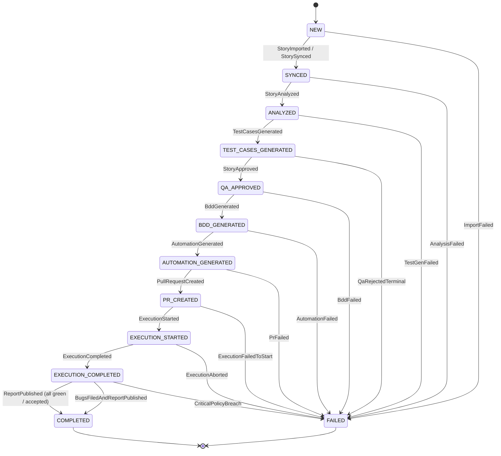
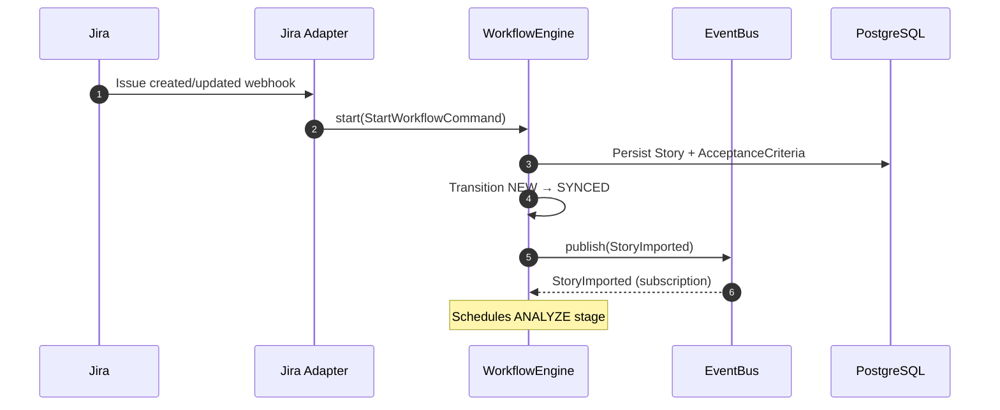
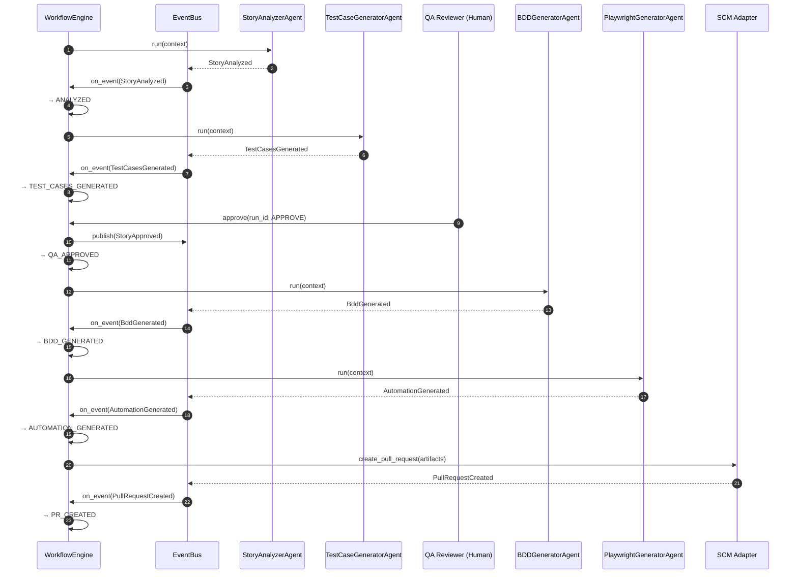
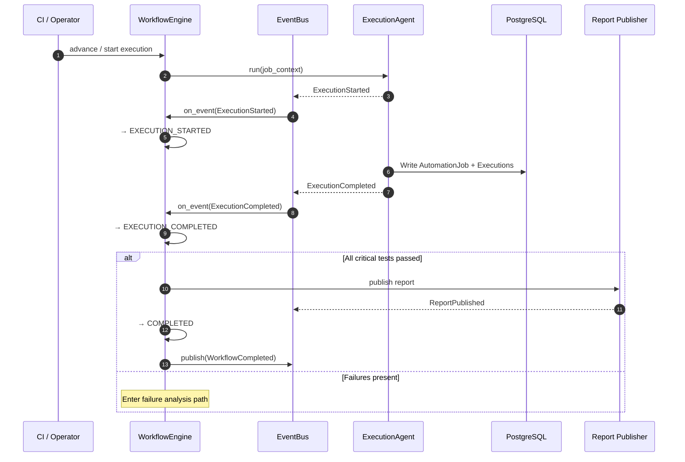

# System Architecture

## Document Information

| Field | Value |
|-------|-------|
| Version | 2.0 |
| Focus | AI QA Workflow Engine (orchestration layer) |
| Last Updated | 2026-07-16 |
| Status | Design only — no APIs, no business logic implementation |

---

## 1. Overview

The AI QA Platform automates the QA lifecycle from **Jira story import** through **AI-assisted test generation**, **automation**, **execution**, and **failure analysis / reporting**.

This document defines the **orchestration layer**: workflow stages, state machine, domain events, event bus, workflow engine, and agent contracts.

| In scope | Out of scope (this phase) |
|----------|---------------------------|
| Workflow stages & state machine | REST APIs |
| Event catalog & event bus interface | Business logic / services |
| Workflow engine interface | Agent LLM prompts / implementations |
| Agent interfaces (ports) | Repositories, auth, UI |
| Sequence diagrams | Concrete message broker choice lock-in |

**Guiding principle:** Agents are **pluggable workers**. The Workflow Engine owns **state transitions**. The Event Bus owns **decoupled communication**. No agent calls another agent directly.

---

## 2. Architecture Diagram

```
┌──────────────────────────────────────────────────────────────────────────┐
│                              FRONTEND                                     │
│                     Next.js + React + TypeScript                          │
└───────────────────────────────────┬──────────────────────────────────────┘
                                    │ REST (future)
                                    ▼
┌──────────────────────────────────────────────────────────────────────────┐
│                              BACKEND (FastAPI)                            │
│  ┌────────────┐  ┌─────────────┐  ┌────────────────────────────────────┐ │
│  │ API Layer  │  │  Services   │  │     ORCHESTRATION LAYER            │ │
│  │  (future)  │──│  (future)   │──│  WorkflowEngine + EventBus         │ │
│  └────────────┘  └─────────────┘  │  WorkflowState machine             │ │
│                                    └───────────────┬────────────────────┘ │
│                                                    │ events               │
│                                    ┌───────────────▼────────────────────┐ │
│                                    │           AI AGENTS (ports)         │ │
│                                    │  Analyzer │ TestGen │ BDD │ Auto   │ │
│                                    │  Execute  │ Failure │ BugCreate    │ │
│                                    └────────────────────────────────────┘ │
└───────────────────────────────────┬──────────────────────────────────────┘
                                    │
          ┌─────────────────────────┼─────────────────────────┐
          ▼                         ▼                         ▼
   ┌─────────────┐          ┌─────────────┐          ┌─────────────────┐
   │  PostgreSQL │          │ Jira / SCM  │          │ Playwright / CI │
   │  (domain)   │          │ (adapters)  │          │ (adapters)      │
   └─────────────┘          └─────────────┘          └─────────────────┘
```

**Layering**

| Layer | Responsibility |
|-------|----------------|
| Presentation | HTTP (future) — starts/cancels workflows, reads status |
| Application / Services | Use cases (future) — not designed here |
| **Orchestration** | WorkflowEngine, EventBus, state transitions |
| Domain | Entities from `docs/Database.md` (Story, TestCase, …) |
| Agents | AI/automation ports invoked by orchestration |
| **Connectors** | Pluggable external integrations (`app/connectors`) — see [`ConnectorArchitecture.md`](./ConnectorArchitecture.md) |
| Adapters | Concrete providers under `connectors/` — **Jira Cloud + GitHub implemented**; AI/others later |

---

## 3. End-to-End Workflow: Jira Story → Test Execution Report

### 3.1 Happy path (stages)

```
[1] Import          Jira story + AC synced into platform
[2] Analyze         StoryAnalyzerAgent extracts intent, risks, gaps
[3] Generate tests  TestCaseGeneratorAgent produces test cases
[4] QA gate         Human QA reviews/approves generated cases
[5] Generate BDD    BDDGeneratorAgent emits Cucumber/Gherkin features
[6] Generate auto   PlaywrightGeneratorAgent emits Playwright scripts
[7] Open PR         Automation PR created against target repo (SCM)
[8] Execute         ExecutionAgent runs suite → AutomationJob + Executions
[9] Report          Aggregate results into execution report
[10] Close          Workflow COMPLETED (or branch to failure analysis)
```

### 3.2 Failure branch

```
Execution failed / flaky / error
        │
        ▼
FailureAnalysisAgent  → root cause, classification, suggested fix
        │
        ▼
BugCreationAgent      → Bug entity (+ optional Jira defect)
        │
        ▼
Report updated; workflow may end FAILED or COMPLETED with defects
```

### 3.3 Stage catalog

| # | Stage ID | Name | Trigger | Primary actor | Output artifacts |
|---|----------|------|---------|---------------|------------------|
| 1 | `IMPORT` | Story Import | Jira webhook / sync job | Adapter + Engine | Story, AcceptanceCriteria (`SYNCED`) |
| 2 | `ANALYZE` | Story Analysis | `StoryImported` / `StorySynced` | StoryAnalyzerAgent | Analysis result, risk tags (`ANALYZED`) |
| 3 | `TEST_GEN` | Test Case Generation | Analysis complete | TestCaseGeneratorAgent | TestCase rows (`TEST_CASES_GENERATED`) |
| 4 | `QA_REVIEW` | QA Approval Gate | Test cases ready | Human QA | Approval decision (`QA_APPROVED`) |
| 5 | `BDD_GEN` | BDD Generation | QA approved | BDDGeneratorAgent | Feature files (`BDD_GENERATED`) |
| 6 | `AUTO_GEN` | Automation Generation | BDD ready | PlaywrightGeneratorAgent | Playwright scripts (`AUTOMATION_GENERATED`) |
| 7 | `PR` | PR Creation | Scripts ready | SCM adapter via Engine | Pull request URL (`PR_CREATED`) |
| 8 | `EXECUTE` | Test Execution | PR merged / manual run / CI | ExecutionAgent | AutomationJob, Executions (`EXECUTION_*`) |
| 9 | `FAIL_ANALYZE` | Failure Analysis | Failed executions | FailureAnalysisAgent | Analysis notes |
| 10 | `BUG_CREATE` | Bug Creation | Actionable failure | BugCreationAgent | Bug (+ optional external id) |
| 11 | `REPORT` | Execution Report | Execution finished | Engine / reporter | Report aggregate (`COMPLETED` / `FAILED`) |

Human gate at stage 4 is **mandatory** in the default workflow (quality control before automation spend).

---

## 4. Workflow State Machine

### 4.1 `WorkflowState` enum

Lifecycle state of a **StoryWorkflow** instance (one workflow per story run; re-runs create a new instance or reset under controlled rules).

| State | Meaning |
|-------|---------|
| `NEW` | Workflow created; story not yet synced |
| `SYNCED` | Jira story + AC persisted in platform |
| `ANALYZED` | Story analysis complete |
| `TEST_CASES_GENERATED` | Draft test cases generated |
| `QA_APPROVED` | QA approved test cases for automation path |
| `BDD_GENERATED` | Gherkin/BDD artifacts generated |
| `AUTOMATION_GENERATED` | Playwright (or other) scripts generated |
| `PR_CREATED` | Automation PR opened |
| `EXECUTION_STARTED` | Automation job running |
| `EXECUTION_COMPLETED` | All executions finished (pass or fail mix) |
| `FAILED` | Terminal failure (unrecoverable stage error or policy fail) |
| `COMPLETED` | Terminal success; report available |

Optional future states (not required now): `QA_REJECTED`, `PR_MERGED`, `CANCELLED`, `RETRYING`.

### 4.2 Allowed transitions



**Rules**

1. Only the **Workflow Engine** mutates `WorkflowState`.
2. Agents emit **events**; they never set state directly.
3. Invalid transitions raise a domain error and leave state unchanged.
4. `FAILED` and `COMPLETED` are terminal unless an explicit **RestartWorkflow** command creates a new run.

### 4.3 Stage ↔ state mapping

| After stage | WorkflowState |
|-------------|---------------|
| Import | `SYNCED` |
| Analyze | `ANALYZED` |
| Test gen | `TEST_CASES_GENERATED` |
| QA approve | `QA_APPROVED` |
| BDD gen | `BDD_GENERATED` |
| Automation gen | `AUTOMATION_GENERATED` |
| PR create | `PR_CREATED` |
| Execution start | `EXECUTION_STARTED` |
| Execution finish | `EXECUTION_COMPLETED` |
| Report close (success path) | `COMPLETED` |
| Unrecoverable error | `FAILED` |

---

## 5. Domain Events

### 5.1 `WorkflowEvent` enum

Events are **facts that already happened**. Commands (e.g. ApproveStory) are separate and may be issued by APIs later; the engine converts successful command handling into events.

| Event | Emitted when | Typical next stage |
|-------|--------------|--------------------|
| `StoryImported` | Jira story first landed | Analyze |
| `StorySynced` | Re-sync updated story/AC | Re-analyze (policy) |
| `StoryAnalyzed` | Analyzer finished | Test gen |
| `TestCasesGenerated` | Test cases persisted | QA review |
| `StoryApproved` | QA approved cases | BDD gen |
| `StoryRejected` | QA rejected cases | Stop / revise (often `FAILED` or stay) |
| `BddGenerated` | Feature files ready | Automation gen |
| `AutomationGenerated` | Scripts ready | PR create |
| `PullRequestCreated` | SCM PR opened | Wait / execute |
| `ExecutionStarted` | AutomationJob running | Wait |
| `ExecutionCompleted` | Job finished | Report / failure analysis |
| `ExecutionFailed` | Job could not complete | Failure analysis / `FAILED` |
| `FailureAnalyzed` | Root-cause analysis done | Bug create / report |
| `BugCreated` | Bug filed | Report |
| `ReportPublished` | Execution report available | `COMPLETED` |
| `WorkflowFailed` | Engine marked terminal failure | — |
| `WorkflowCompleted` | Engine marked terminal success | — |

### 5.2 Event envelope (contract)

Every published message carries a standard envelope (logical schema, not a DB table yet):

| Field | Description |
|-------|-------------|
| `event_id` | UUID |
| `event_type` | `WorkflowEvent` |
| `occurred_at` | UTC timestamp |
| `correlation_id` | Workflow run id |
| `causation_id` | Prior event or command id |
| `organization_id` | Tenant |
| `project_id` | Project |
| `story_id` | Story (when applicable) |
| `payload` | Event-specific data |
| `metadata` | Producer, version, retry count |

---

## 6. Event Bus Interface

Decouples producers (engine, adapters) from consumers (agents, reporters).

### 6.1 Responsibilities

- Publish domain events
- Subscribe handlers by event type
- Deliver at-least-once (implementation may use in-process, Redis Streams, or SQS later)
- Support correlation for a workflow run

### 6.2 Interface contract

```text
«interface» EventBus
  + publish(event: DomainEvent) -> void
  + publish_batch(events: DomainEvent[]) -> void
  + subscribe(event_type: WorkflowEvent, handler: EventHandler) -> Subscription
  + unsubscribe(subscription: Subscription) -> void

«interface» EventHandler
  + handle(event: DomainEvent) -> void   # async-capable in implementation

«interface» DomainEvent
  + event_id: UUID
  + event_type: WorkflowEvent
  + correlation_id: UUID
  + payload: object
  + occurred_at: DateTime
```

### 6.3 Design notes

- Handlers must be **idempotent** (duplicate delivery possible).
- The Workflow Engine is both a **publisher** (state advanced) and a **subscriber** (reacts to agent completion events).
- Agents never talk to each other; they only publish completion/failure events.

---

## 7. Workflow Engine Interface

The engine is the **single orchestrator**: loads workflow context, validates transitions, invokes the next agent (or waits for human), and persists workflow state (persistence adapter is future).

### 7.1 Interface contract

```text
«interface» WorkflowEngine
  + start(command: StartWorkflowCommand) -> WorkflowRun
      # Import/sync path; state NEW → … → SYNCED

  + on_event(event: DomainEvent) -> void
      # Apply event, transition state, schedule next step

  + advance(run_id: UUID) -> void
      # Drive next automatic stage if preconditions met

  + approve(run_id: UUID, decision: ApprovalDecision) -> void
      # Human QA gate → StoryApproved / StoryRejected

  + retry(run_id: UUID, from_state: WorkflowState) -> WorkflowRun
      # Controlled restart from a prior non-terminal state

  + cancel(run_id: UUID, reason: string) -> void

  + get_status(run_id: UUID) -> WorkflowStatusView
  + get_status_by_story(story_id: UUID) -> WorkflowStatusView
```

### 7.2 Collaboration model

```
Adapter/API ──command──▶ WorkflowEngine ──invoke──▶ Agent
                              │
                              │ publish
                              ▼
                           EventBus ──▶ WorkflowEngine.on_event
                                      ──▶ other subscribers (audit, UI push)
```

### 7.3 What the engine owns vs agents

| Workflow Engine | Agents |
|-----------------|--------|
| State machine & transition rules | Domain AI/automation work |
| Stage ordering & gates | Input validation for their task |
| Timeouts / retry policy hooks | Returning structured results |
| Emitting workflow-level events | Emitting task completion events |
| Idempotent stage scheduling | No cross-agent orchestration |

---

## 8. Agent Interfaces

All agents share a common port so new agents can be registered uniformly.

### 8.1 Common agent port

```text
«interface» Agent
  + name: string
  + supported_events: WorkflowEvent[]   # events that trigger this agent
  + run(context: AgentContext) -> AgentResult

«interface» AgentContext
  + run_id: UUID
  + organization_id: UUID
  + project_id: UUID
  + story_id: UUID
  + workflow_state: WorkflowState
  + input: object                       # stage-specific payload
  + correlation_id: UUID

«interface» AgentResult
  + success: bool
  + output: object
  + artifacts: ArtifactRef[]            # files, URLs, entity ids
  + error: ErrorDetail | null
  + emit_event: WorkflowEvent           # completion event type
```

### 8.2 Specialized agent interfaces

```text
«interface» StoryAnalyzerAgent extends Agent
  # Input:  Story + AcceptanceCriteria
  # Output: intent summary, risk areas, ambiguity flags, coverage hints
  # Emits:  StoryAnalyzed  |  WorkflowFailed (via engine on error)

«interface» TestCaseGeneratorAgent extends Agent
  # Input:  Story + AC + analysis
  # Output: TestCase drafts (steps, expected, priority, AC links)
  # Emits:  TestCasesGenerated

«interface» BDDGeneratorAgent extends Agent
  # Input:  Approved TestCases + Story
  # Output: Gherkin feature/scenario artifacts
  # Emits:  BddGenerated

«interface» PlaywrightGeneratorAgent extends Agent
  # Input:  BDD artifacts + TestCases + project automation config
  # Output: Playwright (or other) script artifacts
  # Emits:  AutomationGenerated

«interface» ExecutionAgent extends Agent
  # Input:  AutomationJob config + selected TestCases / suite
  # Output: Executions (status, duration, evidence)
  # Emits:  ExecutionStarted, then ExecutionCompleted | ExecutionFailed

«interface» FailureAnalysisAgent extends Agent
  # Input:  Failed Executions + scripts + logs/evidence
  # Output: root cause class, flaky vs product bug, suggested fix
  # Emits:  FailureAnalyzed

«interface» BugCreationAgent extends Agent
  # Input:  Failure analysis + Execution + Story/TestCase links
  # Output: Bug entity (+ optional external tracker id)
  # Emits:  BugCreated
```

### 8.3 Agent registry (plug-in point)

```text
«interface» AgentRegistry
  + register(agent: Agent) -> void
  + unregister(name: string) -> void
  + resolve(event_type: WorkflowEvent) -> Agent[]
  + get(name: string) -> Agent
```

The Workflow Engine resolves agents via `AgentRegistry` after each event — **not** via hard-coded switch statements on agent classes.

---

## 9. Sequence Diagrams

### 9.1 Story Import



### 9.2 AI Generation (Analyze → Test Cases → QA → BDD → Automation → PR)



### 9.3 Execution



### 9.4 Failure Analysis

```mermaid
sequenceDiagram
    autonumber
    participant Engine as WorkflowEngine
    participant Bus as EventBus
    participant Fail as FailureAnalysisAgent
    participant Bug as BugCreationAgent
    participant Report as Report Publisher

    Bus->>Engine: ExecutionCompleted (has failures)
    Engine->>Fail: run(failed_executions)
    Fail-->>Bus: FailureAnalyzed
    Bus->>Engine: on_event(FailureAnalyzed)

    alt Product defect
        Engine->>Bug: run(analysis)
        Bug-->>Bus: BugCreated
        Bus->>Engine: on_event(BugCreated)
    else Flaky / env / script issue
        Note over Engine: Skip bug; annotate report
    end

    Engine->>Report: publish report (with defects)
    Report-->>Bus: ReportPublished
    Engine->>Engine: → COMPLETED or FAILED (policy)
    Engine->>Bus: publish(WorkflowCompleted | WorkflowFailed)
```

---

## 10. Component Architecture (orchestration focus)

### 10.1 Frontend Architecture

Consumes workflow status views later (progress timeline per story). Not designed in this phase.

### 10.2 Backend Architecture

```
backend/app/
  orchestration/          # Implemented — WorkflowEngine, EventBus, agents
    engine/               # WorkflowEngine
    events/               # WorkflowEvent, DomainEvent, EventBus
    agents/               # Agent ports + registry
    state/                # WorkflowState transitions
  models/                 # Existing domain schema
  api/ / services/        # Explicitly not part of this design phase
```

### 10.3 Database Architecture

Domain entities already defined in [`Database.md`](./Database.md). Workflow run persistence is implemented: `workflow_runs` + `workflow_logs`. See [`WorkflowEngine.md`](./WorkflowEngine.md).

Suggested future tables (not implemented):

| Table | Purpose |
|-------|---------|
| `workflow_runs` | ✅ Implemented — run_id, story_id, state, retries |
| `workflow_logs` | ✅ Implemented — transition / action log |
| `agent_runs` | Future — per-agent attempt metrics |

---

## 11. How New AI Agents Plug In

Extensibility is a first-class requirement.

### 11.1 Plugin steps

1. **Implement** the common `Agent` port (and optionally a specialized interface).
2. **Declare** `supported_events` (which upstream events trigger the agent).
3. **Register** the agent in `AgentRegistry` at composition root (DI).
4. **Declare** the completion `WorkflowEvent` the agent emits.
5. **Extend** the state machine only if a **new stage** is required:
   - Add `WorkflowState` value(s)
   - Add allowed transitions
   - Document stage in the stage catalog
6. **Subscribe** any side-effect handlers (metrics, notifications) on the Event Bus — not inside the agent.

### 11.2 Example: adding `AccessibilityAgent`

| Step | Change |
|------|--------|
| Events | Add `AccessibilityChecked` |
| State | Optional: `ACCESSIBILITY_CHECKED` between `QA_APPROVED` and `BDD_GENERATED` |
| Agent | `AccessibilityAgent.run` consumes `StoryApproved`, emits `AccessibilityChecked` |
| Registry | `registry.register(AccessibilityAgent)` |
| Engine | Transition table gains `QA_APPROVED → ACCESSIBILITY_CHECKED → BDD_GENERATED` |
| Diagrams | Update AI Generation sequence |

No existing agent code changes. No Event Bus interface change. Engine policy table / transition map is the only orchestration touch point.

### 11.3 Guardrails for plugins

- Agents must not call other agents.
- Agents must not write `WorkflowState`.
- Agents must be idempotent for the same `correlation_id` + stage.
- Breaking changes to envelopes require an event **schema version** field.

---

## 12. Data Flow (request vs workflow)

### 12.1 Synchronous request/response (future API)

```
Client → API → Service → WorkflowEngine.start/approve/get_status → Response
```

### 12.2 Asynchronous workflow

```
Event → EventBus → Engine.on_event → Agent.run → Event → …
```

Long-running stages (generation, execution) are always async via the Event Bus.

### 12.3 Authentication Flow

JWT access + refresh tokens with organization membership RBAC (`admin`, `qa`, `engineer`, `viewer`).

- Endpoints: `/api/v1/auth/register|login|refresh|me`
- Enforcement toggle: `AUTH_ENABLED` (default `false` for backward-compatible tests)
- Write guards (`require_write_access`) applied to Story/Project mutations when enabled

See [`Authentication.md`](./Authentication.md).

---

## 13. Integration Architecture

| System | Role in workflow |
|--------|------------------|
| Jira | Source of Story / AC; optional Bug sink |
| SCM (GitHub/GitLab) | PR creation for generated automation |
| Playwright / CI | Execution backend behind ExecutionAgent |
| LLM provider | Behind analyzer / generators (adapter, not orchestration) |

API design for these integrations is **out of scope** for this document.

---

## 14. Infrastructure Notes

| Concern | Orchestration stance |
|---------|----------------------|
| Dev | In-process Event Bus is acceptable |
| Prod | Swap Event Bus impl to durable broker without changing agent interfaces |
| Scaling | Stateless Engine workers competing on run_id locks; agents scale independently |
| Observability | Every stage emits events with correlation_id for traces |

---

## 15. Security Considerations (orchestration)

- Treat Jira/SCM payloads as untrusted input to agents.
- Human QA gate prevents unreviewed automation from auto-merging without policy.
- Agent outputs (scripts) must be reviewed via PR before execution in protected envs.
- Soft-delete and optimistic locking on domain entities remain as defined in Database.md.

---

## 16. Scalability Considerations

- Partition work by `project_id` / `organization_id`.
- ExecutionAgent should fan out test cases; Engine only tracks job-level state.
- FailureAnalysisAgent runs only on failed executions, not the full suite.
- AgentRegistry enables horizontal addition of specialized agents without rewriting the engine core.

---

## 17. Summary

The AI QA Workflow Engine is an **event-driven state machine**:

1. **Stages** define the business journey from Jira to report.  
2. **`WorkflowState`** is the single source of progress.  
3. **`WorkflowEvent`** facts move the machine forward.  
4. **`EventBus`** decouples producers and consumers.  
5. **`WorkflowEngine`** alone transitions state and schedules work.  
6. **Agents** are replaceable ports registered by event type.  
7. New capabilities plug in via **registry + events + optional new states** — not by forking the engine.

**Implementation of APIs, services, and agent logic is explicitly deferred.**
