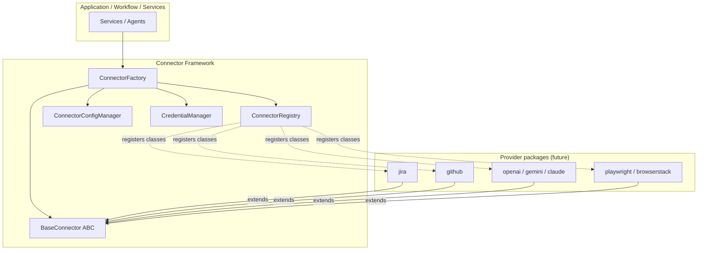
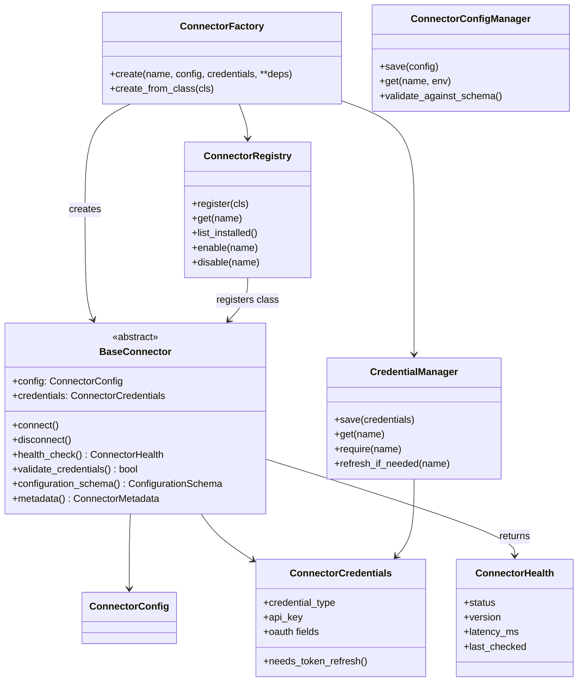
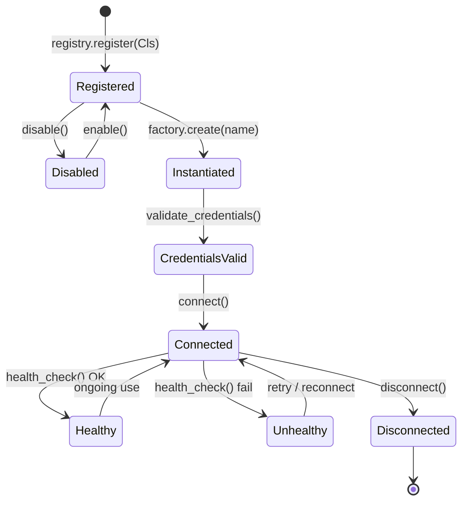
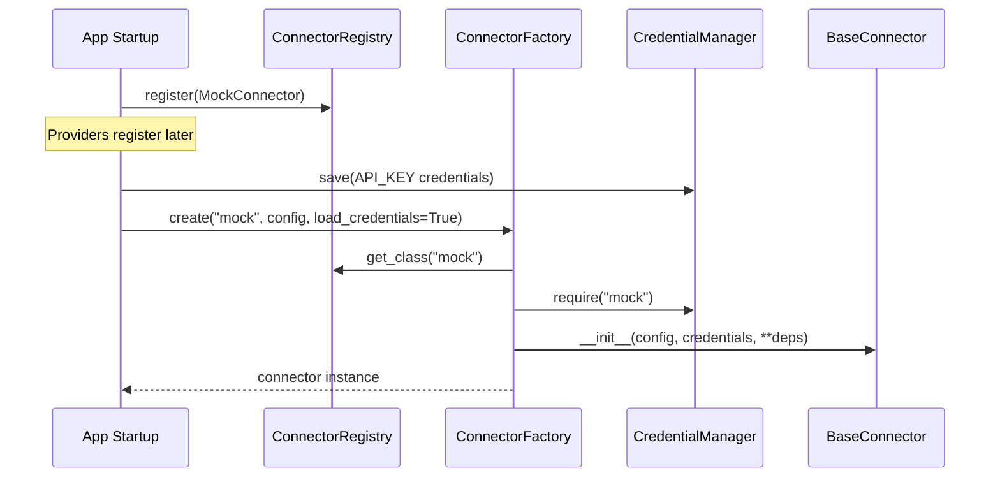
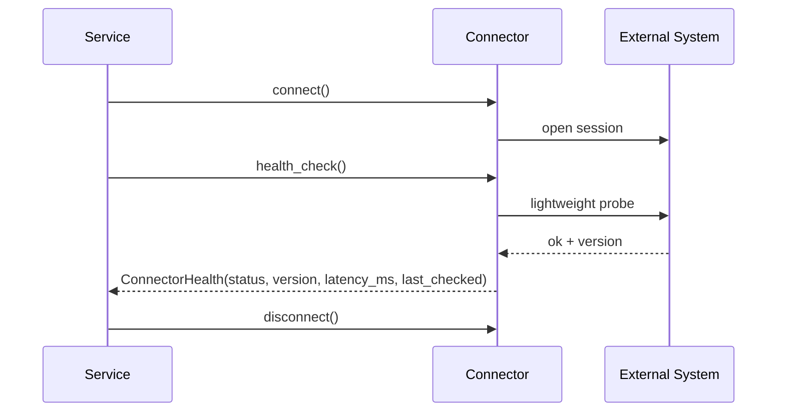

# Connector Framework Architecture

## Document Information

| Field | Value |
|-------|-------|
| Milestone | Connector Framework + Jira Cloud + GitHub providers |
| Status | Framework complete — **Jira Cloud + GitHub implemented** |
| Last Updated | 2026-07-16 |
| Package | `backend/app/connectors/` |
| Jira details | [`docs/JiraIntegration.md`](./JiraIntegration.md) |
| GitHub details | [`docs/GitHubIntegration.md`](./GitHubIntegration.md) |

---

## 1. Purpose

The Connector Framework is a **reusable plugin architecture** for external systems:

| Category | Status |
|----------|--------|
| Issue trackers | **`jira/` implemented** · `azure_devops/` stub |
| Source control | **`github/` implemented** |
| AI providers | Stubs under `connectors/`; real clients in [`app/ai`](./AIFramework.md) |
| Automation / cloud | `playwright/` stub (generation in services) · `browserstack/` stub |

Providers subclass `BaseConnector` and register via `register_builtin_connectors()`. Jira Cloud and GitHub are live providers; others remain stubs.

---

## 2. Package Layout

```
backend/app/connectors/
├── base/              # BaseConnector + shared types
├── registry/          # Dynamic registration / enable-disable
├── factory/           # Instantiation + DI
├── config/            # Versioned configuration
├── credentials/       # Secure credential storage abstraction
├── exceptions/        # Framework errors
├── jira/              # Jira Cloud (REST API v3)
├── github/            # GitHub REST (PAT)
├── openai/            # stub
├── gemini/            # stub
├── claude/            # stub
├── playwright/        # stub
├── browserstack/      # stub
└── azure_devops/      # stub
```

---

## 3. Architecture Overview



**Rules**

1. Application code never imports a provider SDK directly — only `BaseConnector` via the Factory.
2. Providers never call each other; they only implement the contract.
3. Secrets never appear in logs (`SecretStr` + `masked_summary()`).

---

## 4. Class Diagram



---

## 5. Connector Lifecycle



### Lifecycle steps

| Step | Component | Action |
|------|-----------|--------|
| 1 | Provider module (future) | Define class extending `BaseConnector` |
| 2 | Registry | `register(MyConnector)` |
| 3 | Config Manager | Save `ConnectorConfig` (env + versioned settings) |
| 4 | Credential Manager | Save `ConnectorCredentials` (API key / OAuth / PAT / …) |
| 5 | Factory | `create("jira", config=..., load_credentials=True, **deps)` |
| 6 | Instance | `await validate_credentials()` → `await connect()` |
| 7 | Ops | `await health_check()` → domain methods (provider-specific) |
| 8 | Shutdown | `await disconnect()` |

---

## 6. Sequence Diagrams

### 6.1 Register and create



### 6.2 Health check



---

## 7. Component Contracts

### 7.1 `BaseConnector`

| Method | Responsibility |
|--------|----------------|
| `metadata()` | Static identity (name, version, category, capabilities) |
| `configuration_schema()` | Declares required/optional settings fields |
| `validate_credentials()` | Structural / auth readiness check |
| `connect()` / `disconnect()` | Session lifecycle |
| `health_check()` | Returns `status`, `version`, `latency_ms`, `last_checked` |

### 7.2 Credential types

`API_KEY` · `OAUTH` · `USERNAME_PASSWORD` · `PAT` · `BEARER_TOKEN`

Token refresh is future-ready via `TokenRefresher` + `needs_token_refresh()`.

### 7.3 Configuration

- Versioned (`config_version`)
- Environment-scoped (`development` / `staging` / `production`)
- Validated against required field names via `ConnectorConfigManager.validate_against_schema`

### 7.4 Storage notes

| Component | Default store | Production intent |
|-----------|---------------|-------------------|
| Credentials | `InMemoryCredentialStore` | Vault / KMS / sealed DB |
| Config | In-memory map | DB table / config service |

No secrets are hardcoded in source.

---

## 8. Jira Cloud provider (implemented)

`JiraConnector` extends `BaseConnector` and is registered at app startup.

| Concern | Implementation |
|---------|----------------|
| Auth | Email + API token → Credential Manager (`USERNAME_PASSWORD`) |
| HTTP | `JiraClient` — pagination, 429/`Retry-After`, 5xx retry |
| Mapping | `mapper.py` — status/type/priority/AC/ADF text |
| REST | `/api/v1/connectors/jira/*` (connect, disconnect, health, projects, boards, sprints, sync) |
| Persistence | Story `jira_issue_id` / `external_id` / `external_updated_at`; `sync_histories` |

See [`docs/JiraIntegration.md`](./JiraIntegration.md).

### 8.1 GitHub provider (implemented)

`GitHubConnector` extends `BaseConnector` and is registered at app startup.

| Concern | Implementation |
|---------|----------------|
| Auth | PAT → Credential Manager (`CredentialType.PAT`) |
| HTTP | `GitHubClient` — pagination, 429/`Retry-After`, 5xx retry |
| REST | `/api/v1/connectors/github/*` (connect, disconnect, health, create-branch, commit, push, pull-request, status-checks) |
| Workflow | Optional `GitHubPRAgent` emits `pull_request_created` |

See [`docs/GitHubIntegration.md`](./GitHubIntegration.md).

### 8.2 How to add another provider

```python
class AzureDevOpsConnector(BaseConnector):
    def metadata(self) -> ConnectorMetadata: ...
    def configuration_schema(self) -> ConfigurationSchema: ...
    async def validate_credentials(self) -> bool: ...
    async def connect(self) -> None: ...
    async def disconnect(self) -> None: ...
    async def health_check(self) -> ConnectorHealth: ...

registry.register(AzureDevOpsConnector)
```

No changes to Registry/Factory contracts required.

---

## 9. Tests

```bash
cd backend
pytest tests/test_connectors.py tests/test_jira_connector.py tests/test_github_connector.py -v
```

Covers Registry, Factory, Credential Manager, Jira mapper/client, GitHub client/registration.

---

## 10. Explicitly out of scope (framework + connector milestones)

- OpenAI / Gemini / Claude / Playwright / BrowserStack / Azure DevOps **connector package implementations** (AI lives under `app/ai`)
- Persistent credential encryption at rest (in-memory store today)
- OAuth authorization-code browser flow
- Jira webhooks / push sync
- Frontend connect wizards
