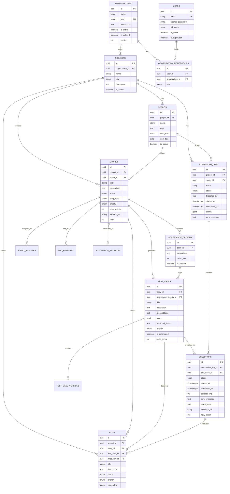

# Database Design

## Document Information

| Field | Value |
|-------|-------|
| Database | PostgreSQL |
| Version | 16 |
| ORM | SQLAlchemy 2.0 (declarative) |
| Migrations | Alembic |
| Last Updated | 2026-07-16 |

---

## 1. Overview

The schema models the AI QA Platform core domain only: multi-tenant organization → project → sprint/story planning → acceptance criteria → test cases → automation jobs → executions → bugs.

**Design principles**

- Every domain table inherits `BaseEntity` (UUID PK, audit timestamps, actor UUIDs, soft delete, optimistic locking).
- `created_by` / `updated_by` are UUID columns; `users` table exists for auth identity (see Authentication milestone).
- Soft delete via `is_deleted`; hard deletes are reserved for cascade cleanup of orphaned children.
- Optimistic concurrency via `version` (`version_id_col` in SQLAlchemy).
- PostgreSQL native ENUMs for constrained status/type/priority values.
- JSONB for structured but evolving payloads (`test_cases.steps`, `automation_jobs.config`).

**Initial migration**

`backend/alembic/versions/20260715_234715_create_domain_schema.py`

```bash
cd backend
alembic upgrade head
```

---

## 2. Entity Relationship Diagram



---

## 3. Why Each Table Exists

| Table | Why it exists |
|-------|----------------|
| **organizations** | Multi-tenant root. Isolates customers/teams so projects and QA data never leak across tenants. |
| **projects** | Product/application boundary inside an org. All QA artifacts (stories, jobs, bugs) hang off a project. |
| **sprints** | Time-boxed planning unit. Lets stories and automation runs be scoped to an iteration without forcing every story into a sprint (backlog = `sprint_id` NULL). |
| **stories** | Source-of-truth requirement for AI test generation and coverage tracking. Carries status, type, priority, and optional external tracker id (Jira later). |
| **acceptance_criteria** | Atomic, testable conditions for a story. Primary structured input for generating test cases; ordered and fulfillment-tracked. |
| **test_cases** | Executable/manual test definitions. Links story → (optional) AC → concrete steps/expected result; marks automation readiness. |
| **automation_jobs** | Batch run unit (CI or manual trigger). Aggregates many executions under one job with shared config and lifecycle status. |
| **executions** | Per-test-case run result inside a job. Stores pass/fail, timing, retries, and evidence for analytics and bug filing. |
| **failure_analyses** | AI root-cause / suggested-fix analysis of a failed execution. |
| **bugs** | Defect tracking tied to project and optionally story/test/execution/analysis. Closes the loop from failed execution to defect workflow. |

---

## 4. Shared Base Entity

All domain tables inherit these columns from `BaseEntity`:

| Column | Type | Purpose |
|--------|------|---------|
| `id` | UUID PK | Stable, non-guessable primary key |
| `created_at` | TIMESTAMPTZ | Row creation time (DB default `now()`) |
| `updated_at` | TIMESTAMPTZ | Last modification time |
| `created_by` | UUID NULL | Actor who created the row (User FK deferred) |
| `updated_by` | UUID NULL | Actor who last updated the row |
| `is_deleted` | BOOLEAN | Soft-delete flag (`false` by default) |
| `version` | INTEGER | Optimistic locking counter (starts at `1`) |

---

## 5. Tables

### 5.1 organizations

| Column | Type | Constraints |
|--------|------|-------------|
| id | UUID | PK |
| name | VARCHAR(255) | NOT NULL |
| slug | VARCHAR(100) | NOT NULL, UNIQUE |
| description | TEXT | NULL |
| is_active | BOOLEAN | NOT NULL, default true |
| + BaseEntity columns | | |

### 5.2 projects

| Column | Type | Constraints |
|--------|------|-------------|
| id | UUID | PK |
| organization_id | UUID | FK → organizations.id ON DELETE CASCADE |
| name | VARCHAR(255) | NOT NULL |
| key | VARCHAR(20) | NOT NULL, UNIQUE with organization_id |
| description | TEXT | NULL |
| is_active | BOOLEAN | NOT NULL, default true |
| + BaseEntity columns | | |

### 5.3 sprints

| Column | Type | Constraints |
|--------|------|-------------|
| id | UUID | PK |
| project_id | UUID | FK → projects.id ON DELETE CASCADE |
| name | VARCHAR(255) | NOT NULL |
| goal | TEXT | NULL |
| start_date | DATE | NULL |
| end_date | DATE | NULL |
| is_active | BOOLEAN | NOT NULL, default true |
| + BaseEntity columns | | |

### 5.4 stories

| Column | Type | Constraints |
|--------|------|-------------|
| id | UUID | PK |
| project_id | UUID | FK → projects.id ON DELETE CASCADE |
| sprint_id | UUID | FK → sprints.id ON DELETE SET NULL |
| title | VARCHAR(500) | NOT NULL |
| description | TEXT | NULL |
| status | story_status | NOT NULL, default `draft` |
| story_type | story_type | NOT NULL, default `feature` |
| priority | priority | NOT NULL, default `medium` |
| story_points | INTEGER | NULL |
| external_id | VARCHAR(100) | NULL (e.g. Jira issue key) |
| jira_issue_id | VARCHAR(100) | NULL — stable Jira issue id for sync |
| labels | JSON / JSONB | NULL |
| assignee | VARCHAR(255) | NULL |
| reporter | VARCHAR(255) | NULL |
| external_updated_at | TIMESTAMPTZ | NULL — source updated time (change detection) |
| rank | INTEGER | NULL (backlog/sprint order) |
| + BaseEntity columns | | |

Projects and sprints also carry optional `external_id` for Jira project/sprint ids. Connector runs are recorded in **sync_histories** (provider, status, counts, errors, timestamps).

### 5.5 acceptance_criteria

| Column | Type | Constraints |
|--------|------|-------------|
| id | UUID | PK |
| story_id | UUID | FK → stories.id ON DELETE CASCADE |
| description | TEXT | NOT NULL |
| order_index | INTEGER | NOT NULL, default 0 |
| is_fulfilled | BOOLEAN | NOT NULL, default false |
| + BaseEntity columns | | |

### 5.6 test_cases

| Column | Type | Constraints |
|--------|------|-------------|
| id | UUID | PK |
| story_id | UUID | FK → stories.id ON DELETE CASCADE |
| acceptance_criteria_id | UUID | FK → acceptance_criteria.id ON DELETE SET NULL |
| title | VARCHAR(500) | NOT NULL |
| description | TEXT | NULL |
| preconditions | TEXT | NULL |
| steps | JSONB | NULL — `[{action, expected}, ...]` |
| expected_result | TEXT | NULL |
| priority | priority | NOT NULL, default `medium` |
| is_automated | BOOLEAN | NOT NULL, default false |
| order_index | INTEGER | NOT NULL, default 0 |
| category | VARCHAR(50) | NULL — positive/negative/boundary/api/security/database/accessibility/performance |
| source | VARCHAR(50) | NOT NULL, default `manual` — ai/manual/imported |
| status | VARCHAR(50) | NOT NULL, default `draft` — draft/pending_review/approved/rejected |
| rejection_reason | TEXT | NULL — set when status is rejected |
| tags | JSON | NULL — free-form labels |
| provider | VARCHAR(50) | NULL — AI provider when `source=ai` |
| model | VARCHAR(100) | NULL — AI model when `source=ai` |
| + BaseEntity columns | | |

### 5.6.1 test_case_versions

Immutable snapshots taken before each edit / approve / reject.

| Column | Type | Constraints |
|--------|------|-------------|
| id | UUID | PK |
| test_case_id | UUID | FK → test_cases.id ON DELETE CASCADE |
| version_number | INTEGER | NOT NULL — unique with test_case_id |
| title | VARCHAR(500) | NOT NULL |
| description | TEXT | NULL |
| preconditions | TEXT | NULL |
| steps | JSON | NULL |
| expected_result | TEXT | NULL |
| priority | priority | NOT NULL |
| is_automated | BOOLEAN | NOT NULL, default false |
| category | VARCHAR(50) | NULL |
| tags | JSON | NULL |
| status | VARCHAR(50) | NOT NULL — status at snapshot time |
| change_reason | TEXT | NULL |
| + BaseEntity columns | | |

### 5.6.2 bdd_features

Persisted Gherkin feature artifacts from the AI BDD Generator.

| Column | Type | Constraints |
|--------|------|-------------|
| id | UUID | PK |
| story_id | UUID | FK → stories.id ON DELETE CASCADE |
| name | VARCHAR(500) | NOT NULL — Feature title |
| description | TEXT | NULL |
| gherkin_content | TEXT | NOT NULL — full `.feature` file text |
| tags | JSON | NULL — feature-level `@tags` |
| scenarios | JSON | NULL — structured Scenario / Outline + Examples |
| source_test_case_ids | JSON | NULL — UUIDs used as generation input |
| include_drafts | BOOLEAN | NOT NULL, default false |
| provider | VARCHAR(50) | NULL |
| model | VARCHAR(100) | NULL |
| summary | TEXT | NULL |
| raw_response | JSON | NULL |
| + BaseEntity columns | | |

### 5.6.3 automation_artifacts

Persisted Playwright TypeScript artifacts from the AI Playwright Generator.

| Column | Type | Constraints |
|--------|------|-------------|
| id | UUID | PK |
| story_id | UUID | FK → stories.id ON DELETE CASCADE |
| name | VARCHAR(500) | NOT NULL — suite / package name |
| description | TEXT | NULL |
| language | VARCHAR(50) | NOT NULL, default `typescript` |
| framework | VARCHAR(50) | NOT NULL, default `playwright` |
| page_objects | JSON | NULL — `[{path, content, description?}]` |
| locators | JSON | NULL |
| fixtures | JSON | NULL |
| utilities | JSON | NULL |
| assertions | JSON | NULL |
| hooks | JSON | NULL |
| specs | JSON | NULL — `*.spec.ts` files |
| source_bdd_feature_ids | JSON | NULL |
| source_test_case_ids | JSON | NULL |
| use_bdd | BOOLEAN | NOT NULL, default true |
| use_test_cases | BOOLEAN | NOT NULL, default true |
| include_drafts | BOOLEAN | NOT NULL, default false |
| provider | VARCHAR(50) | NULL |
| model | VARCHAR(100) | NULL |
| summary | TEXT | NULL |
| raw_response | JSON | NULL |
| + BaseEntity columns | | |

### 5.7 automation_jobs

| Column | Type | Constraints |
|--------|------|-------------|
| id | UUID | PK |
| project_id | UUID | FK → projects.id ON DELETE CASCADE |
| sprint_id | UUID | FK → sprints.id ON DELETE SET NULL |
| name | VARCHAR(255) | NOT NULL |
| status | automation_status | NOT NULL, default `pending` |
| triggered_by | UUID | NULL (actor; User FK deferred) |
| started_at | TIMESTAMPTZ | NULL |
| completed_at | TIMESTAMPTZ | NULL |
| config | JSONB | NULL (browser, env, tags, …) |
| error_message | TEXT | NULL |
| + BaseEntity columns | | |

### 5.8 executions

| Column | Type | Constraints |
|--------|------|-------------|
| id | UUID | PK |
| automation_job_id | UUID | FK → automation_jobs.id ON DELETE CASCADE |
| test_case_id | UUID | FK → test_cases.id ON DELETE CASCADE |
| status | execution_status | NOT NULL, default `pending` |
| started_at | TIMESTAMPTZ | NULL |
| completed_at | TIMESTAMPTZ | NULL |
| duration_ms | INTEGER | NULL |
| error_message | TEXT | NULL |
| stack_trace | TEXT | NULL |
| evidence_url | VARCHAR(1000) | NULL |
| retry_count | INTEGER | NOT NULL, default 0 |
| + BaseEntity columns | | |

### 5.9 failure_analyses

| Column | Type | Constraints |
|--------|------|-------------|
| id | UUID | PK |
| execution_id | UUID | FK → executions.id ON DELETE CASCADE |
| category | VARCHAR(40) | NOT NULL, default `unknown` |
| is_flaky | BOOLEAN | NOT NULL, default false |
| is_product_bug | BOOLEAN | NOT NULL, default false |
| summary | TEXT | NOT NULL |
| root_cause | TEXT | NOT NULL |
| suggested_fix | TEXT | NOT NULL |
| confidence | FLOAT | NULL |
| notes | TEXT | NULL |
| logs | TEXT | NULL |
| screenshot_url | VARCHAR(1000) | NULL |
| video_url | VARCHAR(1000) | NULL |
| network_url | VARCHAR(1000) | NULL |
| trace_url | VARCHAR(1000) | NULL |
| provider | VARCHAR(50) | NULL |
| model | VARCHAR(100) | NULL |
| raw_response | JSON | NULL |
| + BaseEntity columns | | |

### 5.10 bugs

| Column | Type | Constraints |
|--------|------|-------------|
| id | UUID | PK |
| project_id | UUID | FK → projects.id ON DELETE CASCADE |
| story_id | UUID | FK → stories.id ON DELETE SET NULL |
| test_case_id | UUID | FK → test_cases.id ON DELETE SET NULL |
| execution_id | UUID | FK → executions.id ON DELETE SET NULL |
| failure_analysis_id | UUID | FK → failure_analyses.id ON DELETE SET NULL |
| title | VARCHAR(500) | NOT NULL |
| description | TEXT | NULL |
| status | bug_status | NOT NULL, default `open` |
| priority | priority | NOT NULL, default `medium` |
| external_id | VARCHAR(100) | NULL |
| extra_metadata | JSON | NULL (summary, logs/execution/jira links) |
| + BaseEntity columns | | |

---

## 6. Enumerations

| Enum | Values | Used by |
|------|--------|---------|
| `story_status` | draft, ready, in_progress, in_review, done, blocked | stories.status |
| `story_type` | feature, bug, task, spike, enhancement | stories.story_type |
| `priority` | critical, high, medium, low | stories, test_cases, bugs |
| `automation_status` | pending, queued, running, completed, failed, cancelled | automation_jobs.status |
| `execution_status` | pending, running, passed, failed, skipped, error, blocked | executions.status |
| `bug_status` | open, in_progress, resolved, verified, closed, reopened | bugs.status |
| `FailureCategory` (string) | product_bug, test_bug, flaky, environment, timeout, unknown | failure_analyses.category |
| `TestCaseCategory` (string) | positive, negative, boundary, api, security, database, accessibility, performance | test_cases.category |
| `TestCaseSource` (string) | ai, manual, imported | test_cases.source |
| `TestCaseStatus` (string) | draft, pending_review, approved, rejected | test_cases.status |

Python definitions live in `backend/app/models/enums.py`. Shared SQLAlchemy Enum types live in `backend/app/models/types.py` so PostgreSQL ENUM types are created once.

---

## 7. Relationships Summary

```
Organization 1 ── * Project
Project       1 ── * Sprint
Project       1 ── * Story
Project       1 ── * AutomationJob
Project       1 ── * Bug
Sprint        1 ── * Story              (optional; NULL = backlog)
Sprint        1 ── * AutomationJob      (optional scope)
Story         1 ── * AcceptanceCriteria
Story         1 ── * TestCase
Story         1 ── * StoryAnalysis
Story         1 ── * BddFeature
Story         1 ── * Bug                (optional)
AcceptanceCriteria 1 ── * TestCase      (optional mapping)
AutomationJob 1 ── * Execution
TestCase      1 ── * Execution
TestCase      1 ── * Bug                (optional)
TestCase      1 ── * TestCaseVersion
Execution     1 ── * FailureAnalysis
Execution     1 ── * Bug                (optional)
FailureAnalysis 1 ── * Bug              (optional)
```

**Cascade policy**

- Deleting an org/project/story/job cascades to owned children where the child cannot exist alone.
- Optional links (`sprint_id`, `acceptance_criteria_id`, bug provenance FKs) use `ON DELETE SET NULL` so history is preserved when the parent planning object is removed.

---

## 8. Indexes

| Index | Table | Columns | Notes |
|-------|-------|---------|-------|
| ix_organizations_slug | organizations | slug | UNIQUE |
| uq_projects_organization_id_key | projects | organization_id, key | UNIQUE |
| ix_projects_organization_id | projects | organization_id | FK lookup |
| ix_sprints_project_id | sprints | project_id | FK lookup |
| ix_stories_project_id / sprint_id / status / priority / external_id | stories | … | list/filter/Jira sync |
| ix_acceptance_criteria_story_id | acceptance_criteria | story_id | FK lookup |
| ix_test_cases_story_id / acceptance_criteria_id / priority / category / source / status | test_cases | … | list/filter |
| ix_test_case_versions_test_case_id / (test_case_id, version_number) unique | test_case_versions | … | history |
| ix_bdd_features_story_id | bdd_features | story_id | FK lookup |
| ix_automation_artifacts_story_id | automation_artifacts | story_id | FK lookup |
| ix_automation_jobs_project_id / sprint_id / status | automation_jobs | … | job queues |
| ix_executions_automation_job_id / test_case_id / status | executions | … | run results |
| ix_bugs_project_id / story_id / test_case_id / execution_id / status / priority / external_id | bugs | … | triage & sync |

---

## 9. Migrations

| Item | Location |
|------|----------|
| Alembic config | `backend/alembic.ini` |
| Env (async) | `backend/alembic/env.py` |
| Domain schema migration | `backend/alembic/versions/20260715_234715_create_domain_schema.py` |
| ORM models | `backend/app/models/` |

**Commands**

```bash
cd backend
alembic upgrade head          # apply
alembic downgrade -1          # rollback one revision
alembic revision --autogenerate -m "description"  # future changes
```

---

## 10. Seed Data

No seed data in this phase. Recommended later:

1. Demo organization + project
2. Sample sprint with 2–3 stories and acceptance criteria
3. Generated test cases for AI pipeline smoke tests

---

## 11. Backup Strategy

| Environment | Strategy |
|-------------|----------|
| Local / Docker | Named volume `postgres_data`; optional `pg_dump` before schema experiments |
| Staging / Production (future) | Daily automated `pg_dump` or managed snapshots; retain ≥ 7 days; test restore quarterly |

Soft deletes reduce accidental data loss for domain rows; physical backups remain mandatory for disaster recovery.

---

## 12. Explicitly Out of Scope (this phase)

- User / Role / Permission tables (auth deferred)
- REST APIs, repositories, services
- Redis / caching schema
- Audit event log table (audit columns on entities only for now)
