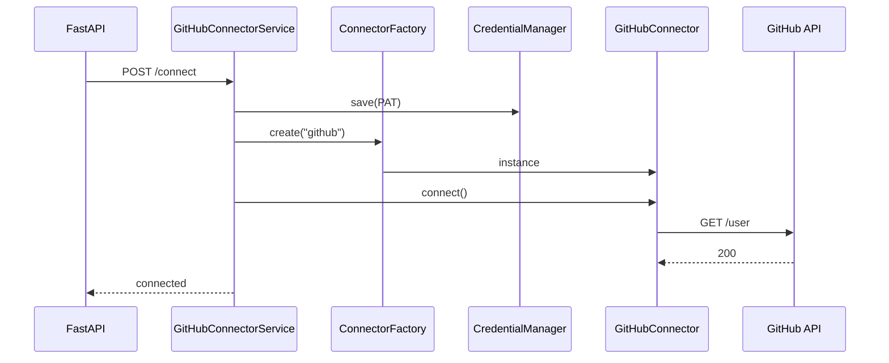

# GitHub Integration

## Document Information

| Field | Value |
|-------|-------|
| Status | Implemented |
| API | GitHub REST API |
| Framework | Uses Connector Framework (`BaseConnector`) |
| Auth | Personal Access Token (PAT) via Credential Manager |
| Last Updated | 2026-07-16 |

---

## 1. Overview

The GitHub connector is the source-control provider on the Connector Framework. It creates branches, commits automation artifacts, opens pull requests, and reads status checks.



---

## 2. Authentication

| Field | Storage |
|-------|---------|
| Personal Access Token | `ConnectorCredentials.api_key` (`CredentialType.PAT`, SecretStr) |
| API base URL | `ConnectorConfig.settings.api_base_url` (default `https://api.github.com`) |
| Default owner / repo | `ConnectorConfig.settings.owner` / `repo` (optional) |
| Default base branch | `ConnectorConfig.settings.default_base_branch` (default `main`) |

Token scopes typically needed: `repo` (or fine-grained Contents + Pull requests + Metadata).

---

## 3. API Endpoints

Base path: `/api/v1/connectors/github`

| Method | Path | Purpose |
|--------|------|---------|
| POST | `/connect` | Validate + store PAT, open session |
| POST | `/disconnect` | Close session, clear credentials |
| GET | `/health` | status, version, latency_ms, last_checked |
| POST | `/create-branch` | Create branch from base |
| POST | `/commit` | Commit files (or AutomationArtifact) + update ref |
| POST | `/push` | Same as `/commit` (REST has no separate push) |
| POST | `/pull-request` | Open a pull request |
| GET | `/status-checks` | Combined statuses + check runs (`?ref=`) |

Swagger tag: **GitHub Connector** (`/docs`).

### Example: connect

```json
{
  "personal_access_token": "ghp_***",
  "owner": "acme-org",
  "repo": "qa-automation",
  "default_base_branch": "main"
}
```

### Example: commit from automation artifact

```json
{
  "branch": "qa/automation-pay-101",
  "message": "Add Playwright suite for PAY-101",
  "automation_artifact_id": "550e8400-e29b-41d4-a716-446655440040"
}
```

Alternatively pass `"files": [{"path": "tests/a.spec.ts", "content": "..."}]`.

---

## 4. Commit / push behaviour

GitHub has no separate “push” over REST. The connector:

1. Resolves the branch tip SHA
2. Creates blobs for each file (utf-8)
3. Creates a tree from the base tree
4. Creates a commit
5. Updates the branch ref (`PATCH …/git/refs/heads/{branch}`)

`POST /push` is an alias of `POST /commit` for API completeness.

**Resilience:** HTTP client paginates list endpoints, retries 429/5xx with `Retry-After` / exponential backoff, and respects rate-limit headers.

---

## 5. Workflow agent (optional)

`GitHubPRAgent` listens for `automation_generated`, then:

1. Creates a branch
2. Commits the latest (or specified) `AutomationArtifact` files
3. Opens a pull request
4. Emits `pull_request_created` (or `pr_failed`)

Registered in `orchestration/runtime.py` via `register_builtin_agents()`.

---

## 6. Key files

| Path | Role |
|------|------|
| `app/connectors/github/connector.py` | `GitHubConnector(BaseConnector)` |
| `app/connectors/github/client.py` | REST client (httpx) |
| `app/services/github_connector.py` | Connect / SCM facade |
| `app/api/v1/endpoints/github.py` | REST routes |
| `app/schemas/github.py` | Request/response models |
| `app/orchestration/agents/github_pr.py` | Workflow PR agent |

---

## 7. Out of scope

- OAuth device / web authorization flow
- Frontend GitHub connect wizard
- GitLab / Azure Repos providers
- Persistent credential encryption at rest (in-memory store today)
