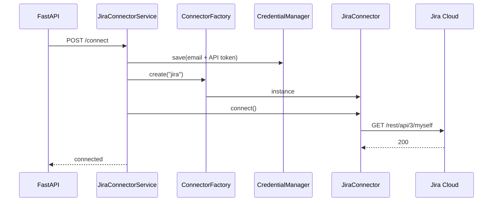

# Jira Cloud Integration

## Document Information

| Field | Value |
|-------|-------|
| Status | Implemented |
| API | Jira Cloud REST API v3 + Agile API |
| Framework | Uses Connector Framework (`BaseConnector`) |
| Last Updated | 2026-07-16 |

---

## 1. Overview

The Jira connector is the first concrete provider on the Connector Framework.



---

## 2. Authentication

| Field | Storage |
|-------|---------|
| Email | `ConnectorCredentials.username` |
| API Token | `ConnectorCredentials.password` (SecretStr) |
| Site URL | `ConnectorConfig.settings.base_url` |

Credential type: `USERNAME_PASSWORD` via Credential Manager.

---

## 3. API Endpoints

| Method | Path | Purpose |
|--------|------|---------|
| POST | `/api/v1/connectors/jira/connect` | Validate + store credentials, open session |
| POST | `/api/v1/connectors/jira/disconnect` | Close session, clear credentials |
| GET | `/api/v1/connectors/jira/health` | status, version, latency_ms, last_checked |
| GET | `/api/v1/connectors/jira/projects` | List Jira projects |
| GET | `/api/v1/connectors/jira/boards` | List boards (`?project_key=`) |
| GET | `/api/v1/connectors/jira/sprints` | List sprints (`?board_id=`) |
| POST | `/api/v1/connectors/jira/sync` | Import into platform + write SyncHistory |

Swagger tag: **Jira Connector** (`/docs`).

---

## 4. Sync behaviour

Uses Jira Cloud ``POST /rest/api/3/search/jql`` (legacy ``/search`` returns HTTP 410).

**Default scope: active sprint only.** Issue JQL:

```text
project = "SCRUM" AND sprint in openSprints() ORDER BY updated DESC
```

Set ``active_sprint_only: false`` on ``POST /connectors/jira/sync`` to import the full project backlog. Future/backlog-only issues are skipped when the flag is true (default).

Imports:

- Project (preserves `external_id` = Jira project id, `key`)
- Active sprint(s) (`external_id` = Jira sprint id; future sprints skipped by default)
- Story: title, description, status, type, priority, labels, assignee, reporter
- Acceptance Criteria (custom field or parsed from description)
- Timestamps: Jira created/updated → `external_updated_at` for change detection
- Stable id: `jira_issue_id` + `external_id` (issue key)

**Update detection:** if `external_updated_at` is unchanged, the story is skipped.

**Sync history:** `sync_histories` table records counts and errors.

**Resilience:** HTTP client paginates, retries 429/5xx with `Retry-After` / exponential backoff.

---

## 5. Key files

| Path | Role |
|------|------|
| `app/connectors/jira/connector.py` | `JiraConnector(BaseConnector)` |
| `app/connectors/jira/client.py` | REST client |
| `app/connectors/jira/mapper.py` | Field mapping |
| `app/services/jira_connector.py` | Connect/health/list facade |
| `app/services/jira_sync.py` | Import + history |
| `app/api/v1/endpoints/jira.py` | REST routes |

---

## 6. Out of scope

- AI analysis
- Jira webhook push sync
- Frontend Jira wizard (later UI milestone)

---

## 7. Related docs

- [UserFlow.md](./UserFlow.md) — customer UI path: connect → sync → automation
- [UserGuide.md](./UserGuide.md) — broader use cases
