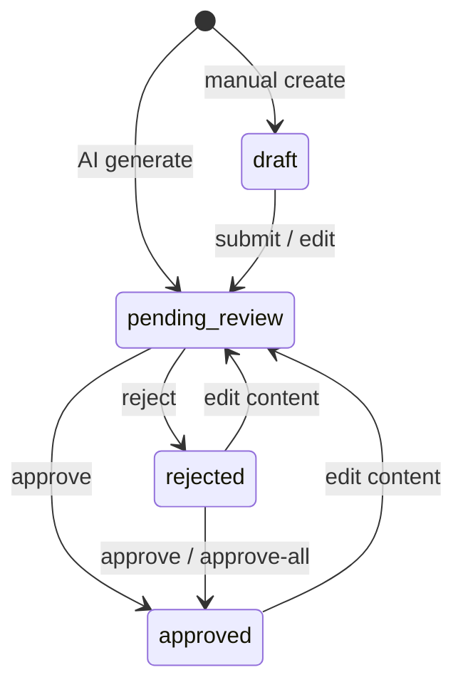

# QA Approval

## Document Information

| Field | Value |
|-------|-------|
| Milestone | QA Approval |
| Status | **Complete** (REST API; no frontend) |
| Last Updated | 2026-07-16 |
| Package | `backend/app/services/qa_approval.py` + related layers |

---

## 1. Purpose

QA review gate for generated (and authored) **TestCase** rows:

- List cases pending review for a story
- Edit content with **version history**
- Approve / reject individuals or **approve-all** for a story
- When every case for a story is approved, optionally advance the workflow engine from `test_cases_generated` → `qa_approved`

---

## 2. Clean Architecture

```
schema (test_case.py)
  → repository (test_case.py, test_case_version.py)
  → service (qa_approval.py)
  → endpoints (test_cases.py, stories.py approve-all)
  → optional WorkflowEngine.approve()
```

| Layer | Module |
|-------|--------|
| Model | `TestCase.status`, `TestCase.rejection_reason`, `TestCaseVersion` |
| Enum | `TestCaseStatus` — `draft` / `pending_review` / `approved` / `rejected` |
| Schema | `TestCaseUpdate`, `TestCaseDecisionResponse`, `TestCaseApproveAllResponse`, `TestCaseVersionResponse` |
| Repository | `TestCaseRepository`, `TestCaseVersionRepository` |
| Service | `QAApprovalService` |
| API | `/api/v1/test-cases/*`, `POST …/stories/{id}/test-cases/approve-all` |
| Migration | `qa_approval_001` |

---

## 3. Status lifecycle



- AI generator persists new cases as **`pending_review`**
- Content edits on approved/rejected cases reset to **`pending_review`** and clear `rejection_reason`
- Each edit / approve / reject writes a **`test_case_versions`** snapshot of the prior content

---

## 4. API

### Story-scoped

| Method | Path | Purpose |
|--------|------|---------|
| `GET` | `/api/v1/stories/{story_id}/test-cases?status=pending_review` | Pending review queue |
| `POST` | `/api/v1/stories/{story_id}/test-cases/approve-all` | Approve all draft/pending/rejected |

### Test-case scoped

| Method | Path | Purpose |
|--------|------|---------|
| `GET` | `/api/v1/test-cases/{id}` | Get one |
| `PUT` | `/api/v1/test-cases/{id}` | Edit (creates version) |
| `POST` | `/api/v1/test-cases/{id}/approve` | Approve one |
| `POST` | `/api/v1/test-cases/{id}/reject` | Reject one (`{"reason": "..."}`) |
| `GET` | `/api/v1/test-cases/{id}/versions` | Version history (newest first) |

Swagger tags: **Test Cases**, **QA Approval**, **Stories**.

### Example — approve-all response

```json
{
  "story_id": "…",
  "approved_count": 5,
  "items": [ /* newly approved TestCaseResponse */ ],
  "workflow_advanced": true,
  "workflow_run_id": "…",
  "message": "All test cases approved; workflow advanced to qa_approved"
}
```

---

## 5. Workflow integration

After an individual approve or approve-all:

1. Count all non-deleted test cases for the story
2. If every case is `approved`, look up the latest `WorkflowRun` for the story
3. If that run’s state is `test_cases_generated`, call `WorkflowEngine.approve(run_id, approved=True)`
4. Otherwise leave the workflow untouched and report why in `message`

Missing workflow runs are **not** an error — QA approval still succeeds.

---

## 6. Version history

Table `test_case_versions` stores snapshots:

| Field | Notes |
|-------|-------|
| `version_number` | 1-based, unique per test case |
| `title`, `description`, `preconditions`, `steps`, `expected_result`, `priority`, `is_automated`, `category`, `tags` | Content at snapshot time |
| `status` | Status before the change |
| `change_reason` | Optional note from edit / approve / reject |

---

## 7. Out of scope

- Frontend review UI
- Role-based auth for approvers
- Partial story approval advancing workflow
