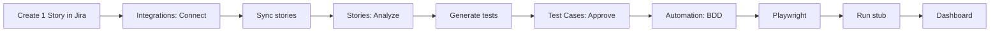

# User Flow — Jira to Automation (Customer Path)

## Document Information

| Field | Value |
|-------|-------|
| Audience | QA engineers, customers, demos |
| Last Updated | 2026-07-17 |
| Related | [UserGuide.md](./UserGuide.md), [JiraIntegration.md](./JiraIntegration.md) |

---

## 1. Overview

End-to-end path a real customer follows in the UI:

**Create one Jira story → Connect Jira → Sync → Analyze → Generate tests → Approve → BDD → Playwright → Stub run → Dashboard**

| App | URL |
|-----|-----|
| Frontend | http://localhost:3000 |
| API docs | http://localhost:8000/api/v1/docs |
| Jira board (example) | https://testaiplatform.atlassian.net/jira/software/projects/SCRUM/boards/1 |

---

## 2. Prerequisites (once)

1. Backend and frontend are running (see [DevelopmentGuide.md](./DevelopmentGuide.md) or [UserGuide.md](./UserGuide.md)).
2. Atlassian API token: https://id.atlassian.com/manage-profile/security/api-tokens
3. Optional for live AI Analyze / Generate: configure `AI_*` keys in `backend/.env` and restart the backend (see [AIFramework.md](./AIFramework.md)).

Without an AI key, sync and CRUD still work; Analyze / Generate need a provider key (or use seeded sample stories for offline demos).

---

## 3. Step-by-step customer flow

### Step 0 — Prep Jira with one real story

1. Open the customer’s Jira project board (e.g. **SCRUM**).
2. Click **Create**.
3. Issue type: **Story**.
4. Example summary: `Reset password from login page`.
5. Add a short description and acceptance criteria.
6. Save the issue (e.g. `SCRUM-1`).

**Tip:** The Board view only shows the **active sprint**. Put the story in the active sprint, or confirm it under **Backlog**, before syncing if sprint grouping matters.

---

### Step 1 — Connect Jira in the platform

1. Open **Integrations**: http://localhost:3000/integrations
2. Fill the Jira Cloud connector form:

| Field | Example |
|-------|---------|
| Site URL | `https://your-site.atlassian.net` |
| Email | Atlassian account email |
| API token | Token from Atlassian security settings |
| Project keys | `SCRUM` (comma-separated if multiple) |

3. Click **Connect**.
4. Wait for Connected status / health OK.

Technical detail: `POST /api/v1/connectors/jira/connect` — see [JiraIntegration.md](./JiraIntegration.md).

---

### Step 2 — Sync the active sprint

1. On the same Integrations page, keep project keys set (e.g. `SCRUM`).
2. Put your story in the **active sprint** on the Jira board (Backlog → drag into the sprint that is started).
3. Click **Sync active sprint**.
4. Read the result message: created / updated / skipped + active sprint name.
5. Open **Stories**: http://localhost:3000/stories
6. Find the imported story (title matches Jira).

Only issues in the current active sprint are imported by default (`sprint in openSprints()`).

Technical detail: `POST /api/v1/connectors/jira/sync` with `active_sprint_only: true`.

---

### Step 3 — Analyze the story

1. In **Stories**, open the synced story (drawer).
2. Click **Analyze story**.
3. Review complexity, risk, and recommended test types.

Requires a configured AI provider for live analysis.

---

### Step 4 — Generate test cases

1. On the same story drawer, click **Generate tests** (or use **Generate with AI** on Test Cases).
2. Open **Test Cases**: http://localhost:3000/test-cases
3. Select the same story.
4. Review the table (positive / negative / boundary, etc.).

---

### Step 5 — QA approval

1. Still on **Test Cases** for that story.
2. **Approve** individual cases, or **Approve all**.
3. **Reject** unsuitable cases with a reason.
4. Only approved cases should continue into automation.

See [QAApproval.md](./QAApproval.md).

---

### Step 6 — Automation (BDD → Playwright → Run)

1. Open **Automation**: http://localhost:3000/automation
2. Select the same story.
3. **1. Generate BDD** — review the Gherkin feature.
4. **2. Generate Playwright** — review TypeScript / POM-style artifacts.
5. **3. Run (stub)** — view pass/fail in the execution table.
6. On a failed run (optional):
   - **Analyze** failure
   - **Create Jira bug** (uses connected Jira; project key e.g. `SCRUM`)

Execution today uses the **stub runner** (no real browsers). See [ExecutionEngine.md](./ExecutionEngine.md).

---

### Step 7 — Dashboard

1. Open **Dashboard**: http://localhost:3000/dashboard
2. Confirm story counts, coverage, execution trends, and AI metrics.

See [Dashboard.md](./Dashboard.md).

---

## 4. Click-path summary

| Step | UI route | Action |
|------|----------|--------|
| 0 | Jira board | Create one Story |
| 1 | `/integrations` | Connect (site, email, token) |
| 2 | `/integrations` | Sync stories |
| 3 | `/stories` | Analyze story |
| 4 | `/stories` or `/test-cases` | Generate tests |
| 5 | `/test-cases` | Approve / Reject |
| 6 | `/automation` | BDD → Playwright → Run |
| 7 | `/dashboard` | Review metrics |

---

## 5. Personas in this flow

| Persona | What they do |
|---------|----------------|
| Admin / QA Lead | Connect Jira under Integrations; manage project keys |
| QA Engineer | Sync, analyze, generate, approve, run stub suite, file bugs |
| Automation Engineer | Review BDD + Playwright artifacts as starting point for real suites |

---

## 6. Known limits (set expectations)

- Sync is **Jira → platform** (import). Creating backlog in Jira is done in Jira itself.
- Execution is a **stub** unless a real Playwright runner is configured later.
- Auth may be off locally (`AUTH_ENABLED=false`); enable for multi-user demos.
- Rotate any API token that was shared in chat after demos.

---

## 7. Related docs

- [UserGuide.md](./UserGuide.md) — broader use cases and quick start
- [JiraIntegration.md](./JiraIntegration.md) — connector API
- [QAApproval.md](./QAApproval.md) — approval workflow
- [BDDGenerator.md](./BDDGenerator.md) / [PlaywrightGenerator.md](./PlaywrightGenerator.md)
- [ExecutionEngine.md](./ExecutionEngine.md) / [FailureAnalysis.md](./FailureAnalysis.md) / [JiraBugCreation.md](./JiraBugCreation.md)
