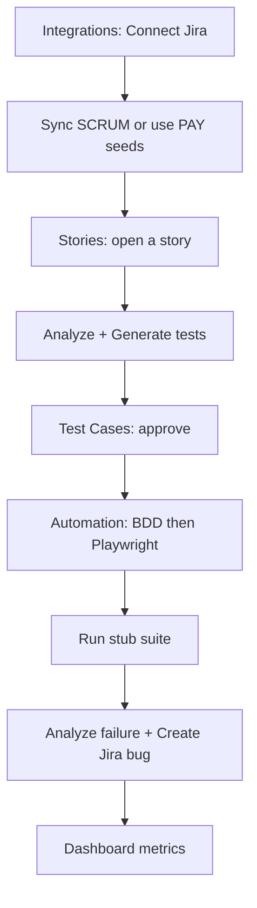

# User Guide — AI QA Platform

## Document Information

| Field | Value |
|-------|-------|
| Audience | QA engineers, developers, admins |
| Last Updated | 2026-07-16 |
| Scope | Demo-complete product (Option A) |

---

## 1. What this app does

End-to-end QA workflow:

**Story → Analyze → Generate tests → Approve → BDD → Playwright artifacts → Stub run → Failure analysis → Jira bug → Dashboard**

| Working today | Stubbed / limited |
|---------------|-------------------|
| Stories, Projects, Sprints UI | Real browser Playwright runs |
| Test Cases UI (generate / approve) | Live SMTP email |
| Automation UI (BDD / PW / run) | |
| Jira connect + sync + bug create | |
| Dashboard metrics | |
| JWT auth (`AUTH_ENABLED`) | Off by default locally |

---

## 2. Personas & use cases

### QA Engineer
1. Sync stories from Jira (or use seeded PAY stories)
2. Generate AI test cases and approve/reject them
3. Generate BDD + Playwright artifacts
4. Run stub suite; analyze failures; file Jira bugs
5. Monitor coverage on Dashboard

### Engineer
1. Review approved cases and automation artifacts
2. Use generated Gherkin / TypeScript as starting point for real suites

### Admin
1. Connect Jira under **Integrations**
2. Manage projects / sprints
3. Optionally enable `AUTH_ENABLED=true`

---

## 3. Quick start

```bash
# From repo root
docker-compose up -d
# or local backend + frontend (see README)

# Load sample data (after migrations)
psql "$DATABASE_URL" -f database/seeds/001_sample_stories.sql
psql "$DATABASE_URL" -f database/seeds/002_sample_pipeline.sql
```

Open:

| App | URL |
|-----|-----|
| Frontend | http://localhost:3000 |
| API docs | http://localhost:8000/api/v1/docs |

Demo IDs from seed:

- Org: `aaaaaaaa-aaaa-4aaa-8aaa-aaaaaaaaaaaa`
- Project PAY: `bbbbbbbb-bbbb-4bbb-8bbb-bbbbbbbbbbbb`
- Story PAY-101: `dddddddd-dddd-4ddd-8ddd-dddddddd0001`

---

## 4. Primary user flow (click path)

Full customer path (create one Jira story → connect → sync → approve → automation) is documented in **[UserFlow.md](./UserFlow.md)**.



### Step-by-step (short)

1. **Integrations** (`/integrations`) — Connect + Sync (`SCRUM`), or use PAY seeds  
2. **Stories** (`/stories`) — Analyze / Generate tests  
3. **Test Cases** (`/test-cases`) — Approve / Reject  
4. **Automation** (`/automation`) — BDD → Playwright → Run (stub) → optional Jira bug  
5. **Dashboard** (`/dashboard`) — Metrics  

See [UserFlow.md](./UserFlow.md) for the detailed customer walkthrough.

---

## 5. Jira setup (manual)

1. Create token: https://id.atlassian.com/manage-profile/security/api-tokens  
2. In UI: Integrations → Connect with:
   - Site: `https://your-site.atlassian.net`
   - Email: your Atlassian account email
   - API token
3. Sync project keys (comma-separated), e.g. `SCRUM`  
4. Organization ID defaults to seed org unless `NEXT_PUBLIC_DEFAULT_ORG_ID` is set

API equivalent: `POST /api/v1/connectors/jira/connect` then `POST .../sync`.

---

## 6. Live AI (Analyze / Generate)

Supported providers in `backend/.env`:

| Provider | Env vars |
|----------|----------|
| Gemini (recommended for AI Studio `AQ.` keys) | `AI_DEFAULT_PROVIDER=gemini`, `AI_GEMINI_API_KEY=…`, `AI_GEMINI_DEFAULT_MODEL=gemini-flash-latest` |
| OpenAI | `AI_DEFAULT_PROVIDER=openai`, `AI_OPENAI_API_KEY=…` |
| Claude | `AI_DEFAULT_PROVIDER=claude`, `AI_CLAUDE_API_KEY=…` |
| Amazon Bedrock | `AI_DEFAULT_PROVIDER=bedrock`, `AI_BEDROCK_API_KEY=…` (AWS Bedrock console key — **not** `AQ.`) |

After changing `.env`, restart the backend. Then use:

- Stories → **Analyze story** / **Generate tests**
- Test Cases → **Generate with AI**
- Automation → BDD / Playwright / Analyze failure

Without a valid key or quota, use seeded test cases / artifacts.

---

## 7. Known limitations

- Execution Engine uses **StubTestRunner** (no real browsers / screenshots beyond stub URLs)
- Email notifications log only (SMTP stub)
- Auth is off unless `AUTH_ENABLED=true`
- Rotate any API token shared in chat after demos

---

## 8. Related docs

- [User Flow](./UserFlow.md) — Jira → automation customer click-path
- [Roadmap](./Roadmap.md)
- [Jira Integration](./JiraIntegration.md)
- [QA Approval](./QAApproval.md)
- [Execution Engine](./ExecutionEngine.md)
- [API](./API.md)
