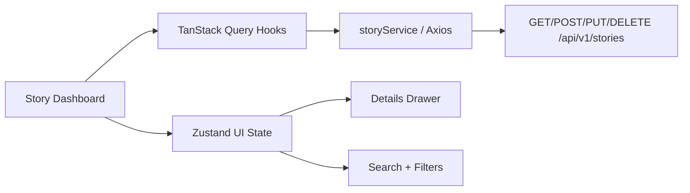

# Frontend Guide — Story Management (Milestone 6)

## Document Information

| Field | Value |
|-------|-------|
| Milestone | 6 — Frontend Story Management |
| Last Updated | 2026-07-16 |
| Stack | Next.js App Router, TypeScript, Tailwind v4, TanStack Query, Zustand, Axios, RHF, Zod |

---

## 1. Overview

The Story Management UI consumes the existing Story CRUD APIs (`/api/v1/stories`) and provides:

- Story dashboard with table, search, filters, pagination
- Create / Edit modals (React Hook Form + Zod)
- Soft-delete confirmation
- Story details drawer
- Loading, empty, and error states
- Responsive app shell (sidebar + header)



---

## 2. Run locally

```bash
# Terminal 1 — backend
cd backend
source venv/bin/activate
uvicorn app.main:app --reload

# Terminal 2 — frontend
cd frontend
cp .env.example .env.local   # if needed
npm install
npm run dev
```

Open http://localhost:3000 → redirects to `/stories`.

### Create Story prerequisite

Stories require an existing `project_id`. Until Milestone 7 (Project CRUD):

1. Insert a project in PostgreSQL, or
2. Set `NEXT_PUBLIC_DEFAULT_PROJECT_ID` in `.env.local`

Example SQL:

```sql
INSERT INTO organizations (id, name, slug, is_active, is_deleted, version, created_at, updated_at)
VALUES (gen_random_uuid(), 'Demo Org', 'demo-org', true, false, 1, now(), now());

INSERT INTO projects (id, organization_id, name, key, is_active, is_deleted, version, created_at, updated_at)
SELECT gen_random_uuid(), id, 'Demo Project', 'DEMO', true, false, 1, now(), now()
FROM organizations WHERE slug = 'demo-org';
```

---

## 3. Key files

| Path | Role |
|------|------|
| `src/app/stories/page.tsx` | Story dashboard route |
| `src/app/stories/loading.tsx` / `error.tsx` | Route loading & error UI |
| `src/components/stories/*` | Feature components |
| `src/components/ui/*` | DataTable, SearchBar, Pagination, badges, Drawer, Modal |
| `src/services/story.service.ts` | API client |
| `src/hooks/useStories.ts` | Query/mutation hooks |
| `src/store/story.store.ts` | Filters + dialog/drawer state |
| `src/types/story.ts` | TypeScript types aligned with backend |
| `src/lib/validators/story.ts` | Zod schemas |

---

## 4. Testing

```bash
cd frontend
npm test
```

Covers Zod validation and `storyService` (mocked Axios).

---

## 5. Explicitly deferred

- Project / Sprint selectors (Milestone 7)
- Auth-gated routes
- Jira sync UI (Milestone 9)
